# SkillTrack Empresas

Aplicación web desarrollada en **Java / Spring Boot** para gestionar empresas y colaboradores que participan en programas de capacitación tecnológica.  
Forma parte del **portafolio final del Bootcamp Fullstack Java**

La solución incluye:

- Módulo web MVC con **JSP + Bootstrap**.
- Acceso a datos con **Spring Data JPA + MySQL**.
- **API REST** de apoyo para empresas y colaboradores.
- **Script de base de datos completo** (creación de esquema, tablas, datos de ejemplo y consultas avanzadas).
- **Módulo de lógica de reportes** con pruebas unitarias **JUnit 5**.

---

##  Objetivos del proyecto

- Aplicar buenas prácticas de **desarrollo web con Spring MVC**.
- Modelar un dominio simple con **empresas, colaboradores, cursos e inscripciones**.
- Implementar consultas SQL con `JOIN`, `WHERE`, `GROUP BY` y `ORDER BY`.
- Construir una pequeña API **RESTful**.
- Incorporar un mini módulo de **lógica + tests unitarios** para demostrar manejo de bucles, condiciones y pruebas automatizadas.
- Entregar un proyecto listo para ser presentado en un **portafolio profesional**.

---

##  Stack tecnológico

- **Lenguaje:** Java (JDK 17+ probado con JDK 21/24)
- **Framework:** Spring Boot 3.x
  - Spring Web (Spring MVC)
  - Spring Data JPA
- **Vista:** JSP, JSTL, Bootstrap 5
- **Base de datos:** MySQL 8
- **Build:** Maven (con wrapper `mvnw`)
- **Testing:** JUnit 5
- **Servidor embebido:** Tomcat 10 (embebido en Spring Boot)

---

##  Modelo de dominio

Tablas principales del esquema `skilltrack`:

- `empresa`
  - `id_empresa` (PK)
  - `nombre`
  - `rubro`
  - `ciudad`
  - `email_contacto`

- `colaborador`
  - `id_colaborador` (PK)
  - `nombre`
  - `rut`
  - `email`
  - `cargo`
  - `id_empresa` (FK → `empresa`)

- `curso`
  - `id_curso` (PK)
  - `nombre`
  - `categoria`
  - `nivel`
  - `duracion_horas`

- `inscripcion`
  - `id_inscripcion` (PK)
  - `id_colaborador` (FK → `colaborador`)
  - `id_curso` (FK → `curso`)
  - `fecha_inscripcion`
  - `estado` (ej: `APROBADO`, `EN_CURSO`, `REPROBADO`)

- `evaluacion`
  - `id_evaluacion` (PK)
  - `id_inscripcion` (FK → `inscripcion`)
  - `nota_final`
  - `observaciones`

---

##  Base de datos y scripts

Los scripts de base de datos se encuentran en la carpeta:

```text
docs/bd/
```

### 1. Script principal de BD

Archivo:

```text
docs/bd/script.sql
```

Este script:

1. Crea la base de datos `skilltrack` (si no existe).
2. Crea todas las tablas del modelo (`empresa`, `colaborador`, `curso`, `inscripcion`, `evaluacion`).
3. Inserta **datos de ejemplo** para pruebas locales.

>  Ideal para ejecutar directamente en MySQL Workbench / consola antes de levantar la aplicación.

### 2. Usuario dedicado para la aplicación

Archivo:

```text
docs/bd/usuario_skilltrack.sql
```

Este script crea un usuario dedicado para la aplicación, por ejemplo:

- Usuario: `skilltrack_user`
- Password: `Skilltrack123$` (o la que se configure localmente)

Se recomienda ejecutar este script **después** de `script.sql` y ajustar la contraseña según el entorno.

---
### 3. Consultas SQL de apoyo (JOIN, WHERE, GROUP BY, ORDER BY)

Archivo:


```text
docs/bd/consultas.sql
```

##  Configuración de la aplicación

Por seguridad, el repositorio no incluye el archivo `application.properties` con credenciales reales.  
En su lugar, se entrega un archivo de ejemplo:

```text
src/main/resources/application-example.properties
```

### Pasos para configurar localmente

1. Crear la base de datos y tablas ejecutando:

   - `docs/bd/script.sql`
   - `docs/bd/usuario_skilltrack.sql`

2. Copiar el archivo de ejemplo:

   ```bash
   cp src/main/resources/application-example.properties src/main/resources/application.properties
   ```

3. Editar `src/main/resources/application.properties` y ajustar:

   ```properties
   spring.datasource.username=skilltrack_user
   spring.datasource.password=TU_PASSWORD_AQUI
   ```

4. Verificar que la URL de conexión apunte a tu MySQL local:

   ```properties
   spring.datasource.url=jdbc:mysql://localhost:3306/skilltrack?useSSL=false&serverTimezone=America/Santiago
   ```

---

##  Ejecución del proyecto

Requisitos previos:

- MySQL 8 instalado y corriendo.
- JDK 17 o superior.
- Maven (puede usarse el wrapper incluido `mvnw`).

### Pasos

1. Clonar el repositorio:

   ```bash
   git clone https://github.com/josecorrea01/skilltrack-empresas.git
   cd skilltrack-empresas
   ```

2. Configurar BD y `application.properties` como se explicó arriba.

3. Levantar la aplicación:

   ```bash
   ./mvnw spring-boot:run
   ```

4. Abrir en el navegador:

   - Página principal:  
      `http://localhost:8080/`

---

##  Funcionalidades principales (Web MVC)

### 1. Módulo Empresas

Rutas principales (lado servidor):

- `GET /empresas`
  - Lista todas las empresas.
  - Permite búsqueda por texto (`q`) en nombre / rubro.
- `GET /empresas/{id}`
  - Muestra el detalle de una empresa.
- `GET /empresas/nueva`
  - Muestra formulario para crear una nueva empresa.
- `POST /empresas`
  - Procesa el formulario y guarda la empresa en BD.
  - Redirige a `/empresas`.

Vistas JSP relacionadas:

- `WEB-INF/views/empresas/lista.jsp`
- `WEB-INF/views/empresas/detalle.jsp`
- `WEB-INF/views/empresas/form.jsp`

Características:

- Uso de **Bootstrap** para tablas, formularios, botones y navbar.
- Uso de **JSTL** (`<c:forEach>`, `<c:if>`) para recorrer y mostrar datos.

### 2. Módulo Colaboradores

Rutas principales:

- `GET /colaboradores`
  - Lista todos los colaboradores.
- `GET /colaboradores/{id}`
  - Muestra detalle de un colaborador.
- `GET /colaboradores/nuevo`
  - Formulario para crear colaborador, seleccionando empresa asociada.
- `POST /colaboradores`
  - Guarda el nuevo colaborador en BD (incluye `rut`, `email`, `cargo`).
  - Redirige a `/colaboradores`.

Vistas JSP relacionadas:

- `WEB-INF/views/colaboradores/lista.jsp`
- `WEB-INF/views/colaboradores/detalle.jsp`
- `WEB-INF/views/colaboradores/form.jsp`

---

##  Mini módulo de lógica y tests (JUnit)

Además del flujo web y REST, el proyecto incluye un mini módulo de lógica de reportes, para mostrar dominio de:

- Bucles (`for`)
- Condiciones (`if`)
- Cálculos sobre colecciones (porcentaje, promedio, conteos)
- Pruebas unitarias con JUnit

### Lógica

Paquetes:

```text
src/main/java/com/jcorrea/skilltrack_empresas/logic/
```

- `ReporteInscripcionService` (interfaz)
- `ReporteInscripcionServiceImpl` (implementación)

Responsabilidades:

- `calcularPorcentajeAprobados(List<String> estados)`
- `calcularPromedioNotas(List<Double> notas)`
- `contarPorEstado(List<String> estados, String estadoBuscado)`

### Tests JUnit

Archivo de test:

```text
src/test/java/com/jcorrea/skilltrack_empresas/logic/ReporteInscripcionServiceImplTest.java
```

Incluye **varios casos de prueba** que cubren:

- Flujos normales (listas con datos).
- Casos borde (listas vacías, valores nulos, mezclas de mayúsculas/minúsculas).

Ejecutar los tests:

```bash
./mvnw test
```

---

##  API REST de apoyo

La aplicación expone un pequeño API REST para integraciones o pruebas con herramientas como Postman/Insomnia.

### Empresas

- `GET /api/empresas`
  - Retorna listado de empresas en formato JSON.

- `GET /api/empresas/{id}`
  - Retorna una empresa específica por ID (JSON).

### Colaboradores

- `GET /api/colaboradores`
  - Retorna listado completo de colaboradores en formato JSON.
  - Utiliza un `ColaboradorDTO` para exponer:
    - `id`, `nombre`, `email`, `rut`, `cargo`
    - `empresaId`, `empresaNombre`

- `GET /api/colaboradores?empresaId={idEmpresa}`
  - Filtra colaboradores por empresa.

>  Estos endpoints son útiles para demostrar el criterio de **controlador REST con buenas prácticas HTTP/REST**.

---
### Vista de exploración de la API

- `GET /api/explorer`
    - Renderiza una vista JSP con enlaces rápidos a los endpoints REST de empresas y colaboradores.
    - Útil como panel de apoyo para pruebas manuales con navegador o para demostración en presentaciones.


##  Estructura del proyecto (resumen)

```text
skilltrack-empresas/
├─ docs/
│  ├─ bd/
│  │  ├─ script.sql               # Crea BD y tablas + datos de ejemplo
│  │  ├─ usuario_skilltrack.sql   # Crea usuario dedicado de BD
│  │  └─ consultas.sql            # Consultas SQL de apoyo (JOIN, WHERE, GROUP BY, ORDER BY)
│  └─ capturas/                   # Evidencias en formato PNG/JPG (ver sección siguiente)
│
├─ src/
│  ├─ main/
│  │  ├─ java/com/jcorrea/skilltrack_empresas/
│  │  │  ├─ controller/           # Controladores MVC y REST
│  │  │  ├─ dto/                  # DTOs para la capa REST (ej. ColaboradorDTO)
│  │  │  ├─ model/                # Entidades JPA
│  │  │  ├─ repository/           # Repositorios Spring Data JPA
│  │  │  ├─ service/              # Servicios de negocio
│  │  │  └─ logic/                # Lógica de reportes (módulo testeable con JUnit)
│  │  └─ webapp/WEB-INF/views/    # JSP (index, empresas, colaboradores, explorer, etc.)
│  └─ test/
│     └─ java/com/jcorrea/skilltrack_empresas/
│        ├─ SkilltrackEmpresasApplicationTests.java
│        └─ logic/                # Tests JUnit de ReporteInscripcionServiceImpl
│
├─ src/main/resources/
│  ├─ application-example.properties
│  └─ (application.properties - ignorado en Git)
│
├─ pom.xml
└─ README.md
```

---

## Evidencias de funcionamiento (capturas)

Todas las capturas se encuentran en:

```text
docs/capturas/
```

---

### 1. Aplicación web (MVC)

**1.1. Arranque de la aplicación**

Consola de Spring Boot con el servidor Tomcat levantando correctamente en el puerto `8080`:


**1.2. Navegación principal**

Página de inicio del panel SkillTrack Empresas (`http://localhost:8080/`):

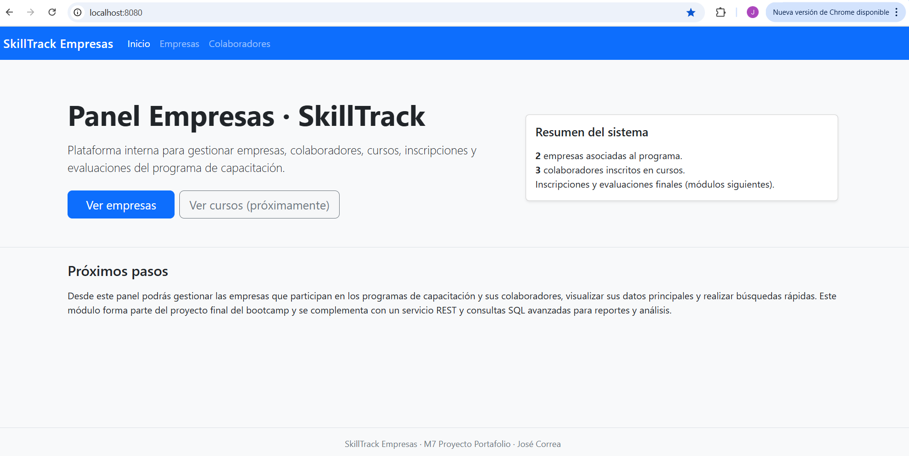

Listado de empresas asociadas:

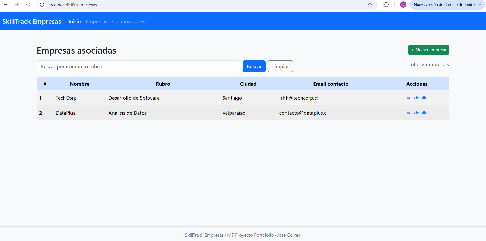

Formulario para crear una nueva empresa:

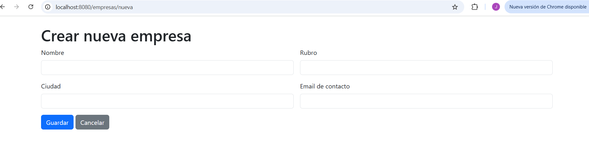

Listado de colaboradores registrados:

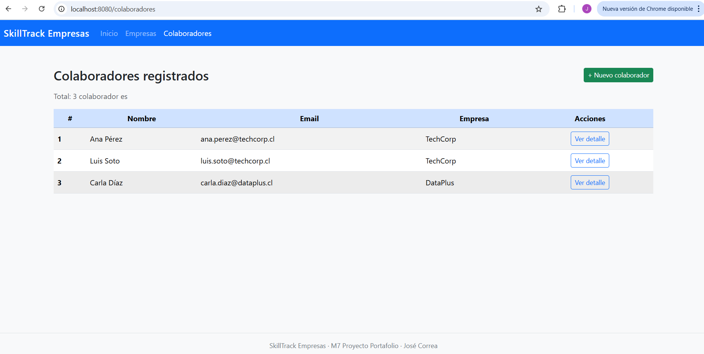

Formulario para crear un nuevo colaborador:

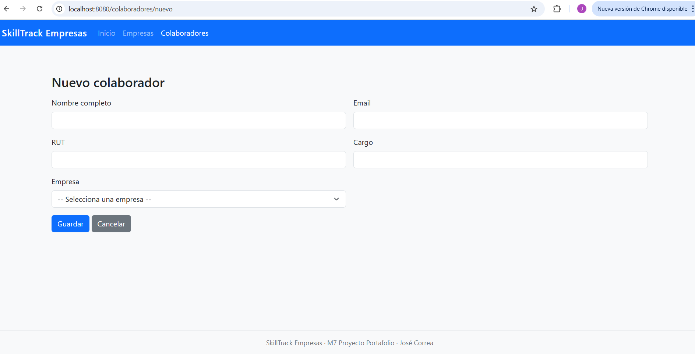

Vista alternativa del listado de empresas en `http://localhost:8080/empresas`:


---

### 2. API REST y vista de exploración

Pruebas de los endpoints REST con Postman y vista JSP de apoyo:

- `GET /api/empresas` – listado de empresas en formato JSON:

  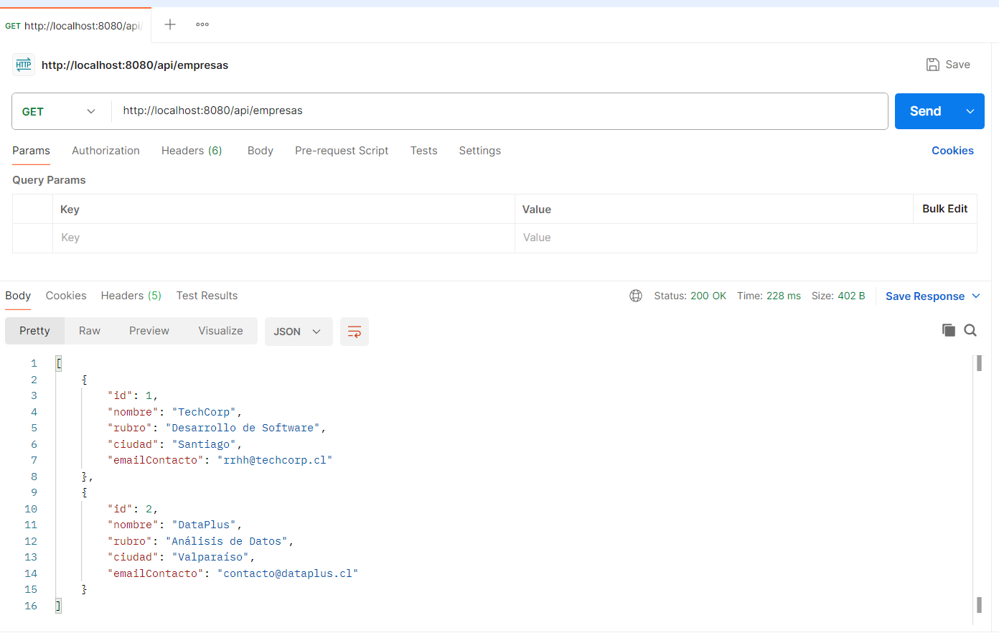

- `GET /api/empresas/1` – detalle de empresa por ID:

  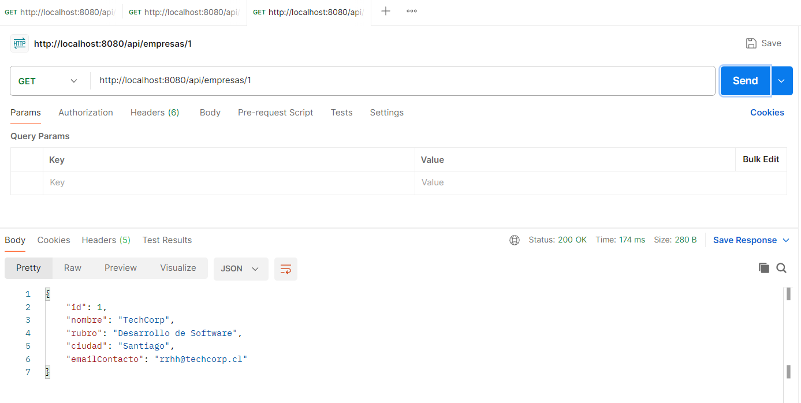

- `GET /api/colaboradores` – listado de colaboradores (con información de empresa):

  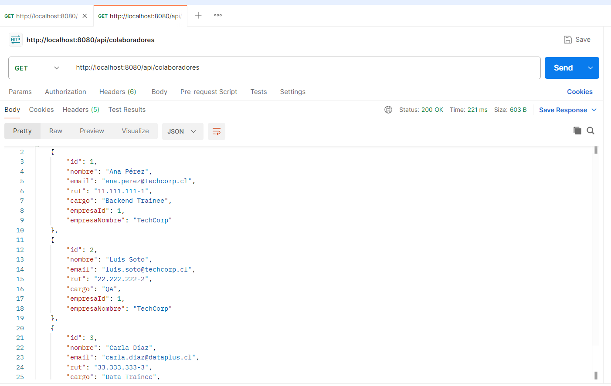

- Vista JSP de exploración de la API (`/api/explorer`):

  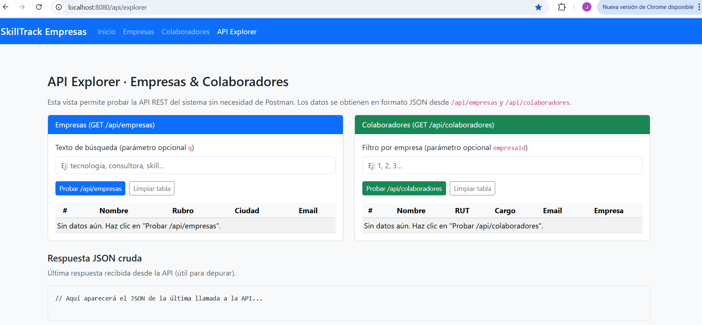

---

### 3. Base de datos y consultas SQL

**3.1. Esquema de la base de datos**

Diagrama del esquema `skilltrack` en MySQL Workbench:

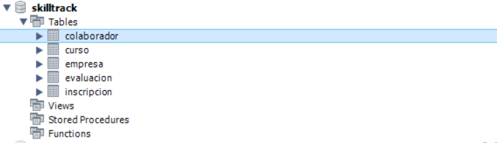

**3.2. Consultas SQL de apoyo**  
(Ejecutadas desde el script `docs/bd/consultas.sql`)

1. Inscripciones con colaborador, curso, categoría y estado  
   (`JOIN` de 3 tablas + `ORDER BY`):

   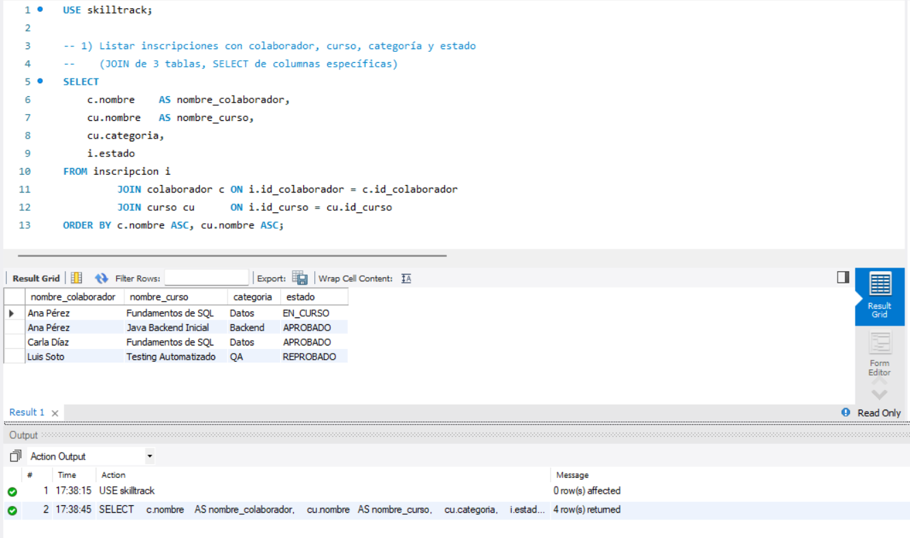

2. `JOIN` de 4 tablas: empresas, colaboradores, inscripciones y evaluaciones  
   (incluye `LEFT JOIN` para nota final):

   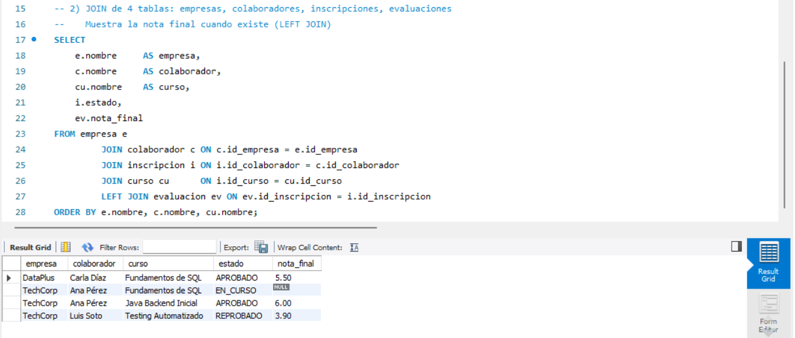

3. Filtro con `WHERE`: colaboradores **aprobados** en cursos **Backend** de una empresa específica:

   

4. `ORDER BY` por nombre de curso y fecha de inscripción (más recientes al inicio):

   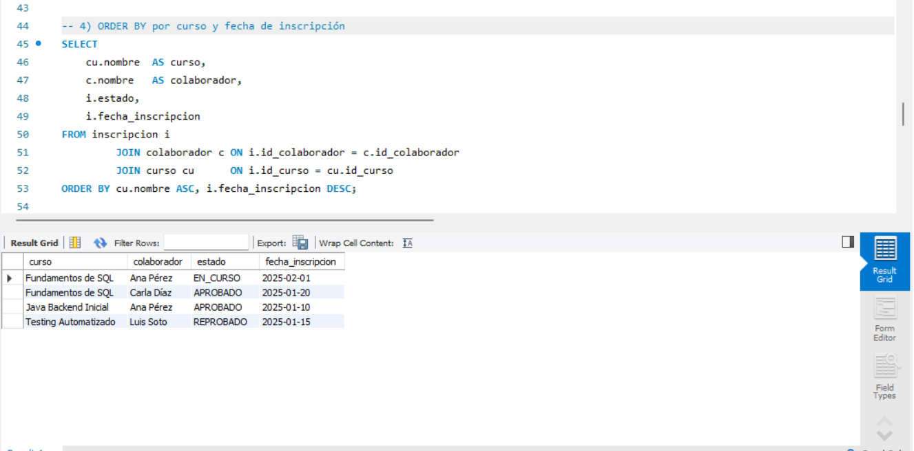

5. `GROUP BY` + funciones de agregación: **porcentaje de aprobación por curso**:

   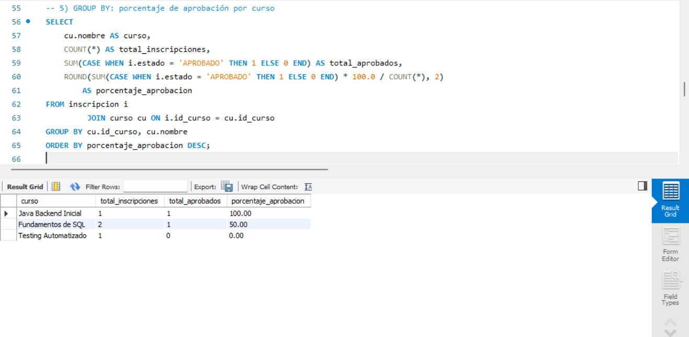

6. `GROUP BY` simple: **cantidad de colaboradores por empresa**:

   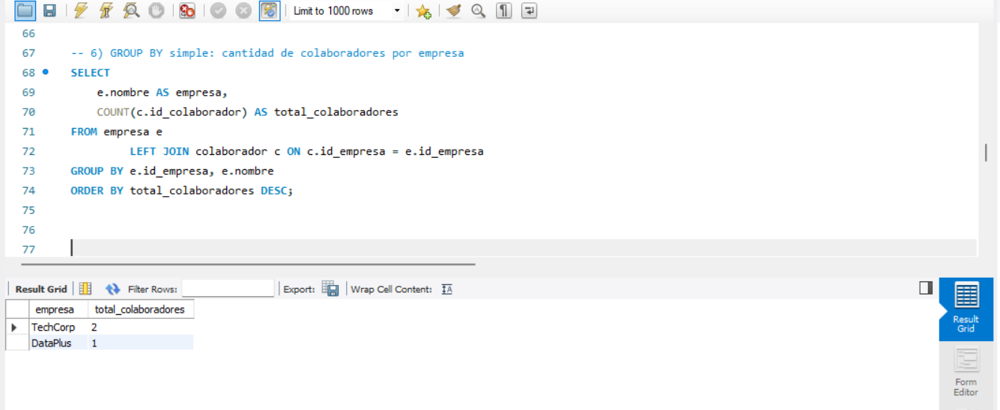

7. TOP de cursos por número de inscripciones (ordenados de mayor a menor):

   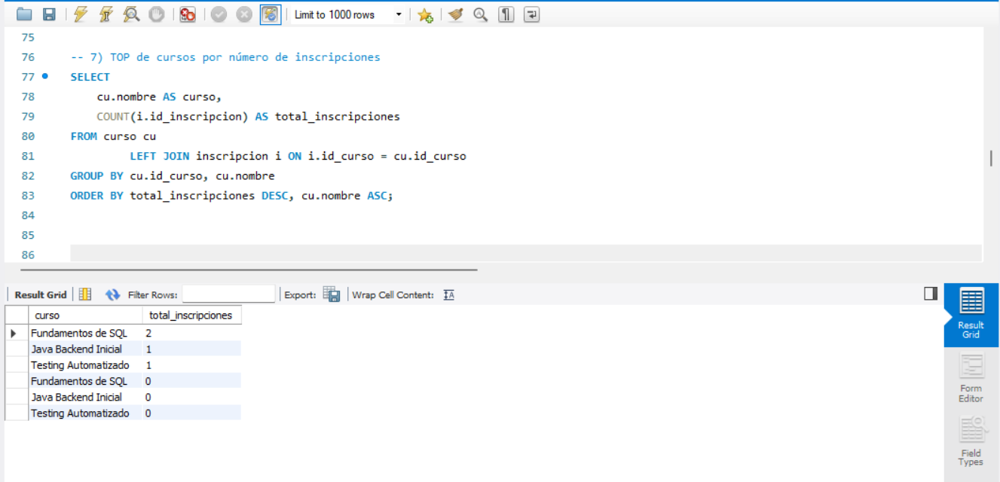

---

### 4. Pruebas automatizadas y build

Pruebas unitarias y build del proyecto con Maven:

- Pruebas JUnit de `ReporteInscripcionServiceImplTest` pasando en IntelliJ:

  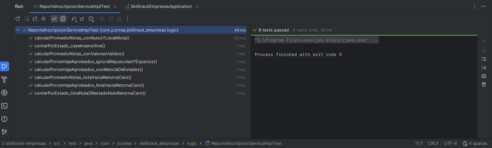

- Ejecución de `mvn clean test` con la base de datos configurada correctamente:

  

- Ejecución general de `mvn test` con `BUILD SUCCESS`:

  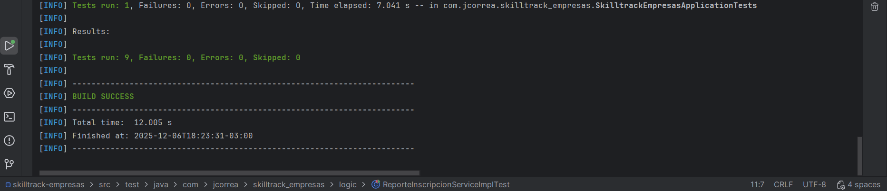

---
## Estado del proyecto

- **Tipo:** Proyecto educativo / demostrativo (no orientado a producción).
- **Contexto:** Evaluación técnica y portafolio del Bootcamp Fullstack Java (Skillnest / Talento Digital), módulo 7.
- **Entorno probado:** Windows 10, IntelliJ IDEA, MySQL 8, JDK 17+.

##  Mejoras futuras

Algunas ideas de evolución del proyecto:

- Agregar autenticación y roles (ADMIN / USER) con Spring Security.
- Incorporar paginación y ordenamiento en las tablas de empresas y colaboradores.
- Añadir más endpoints REST (crear/actualizar/eliminar) siguiendo buenas prácticas RESTful.
- Mejorar el módulo de reportes para calcular estadísticas directamente desde la BD (con consultas JPA/SQL).

---

##  Autor

**José Correa Herrera**  
Proyecto desarrollado como parte del Bootcamp Fullstack Java (Skillnest / Talento Digital), módulo 7 de proyecto final y portafolio de productos.
